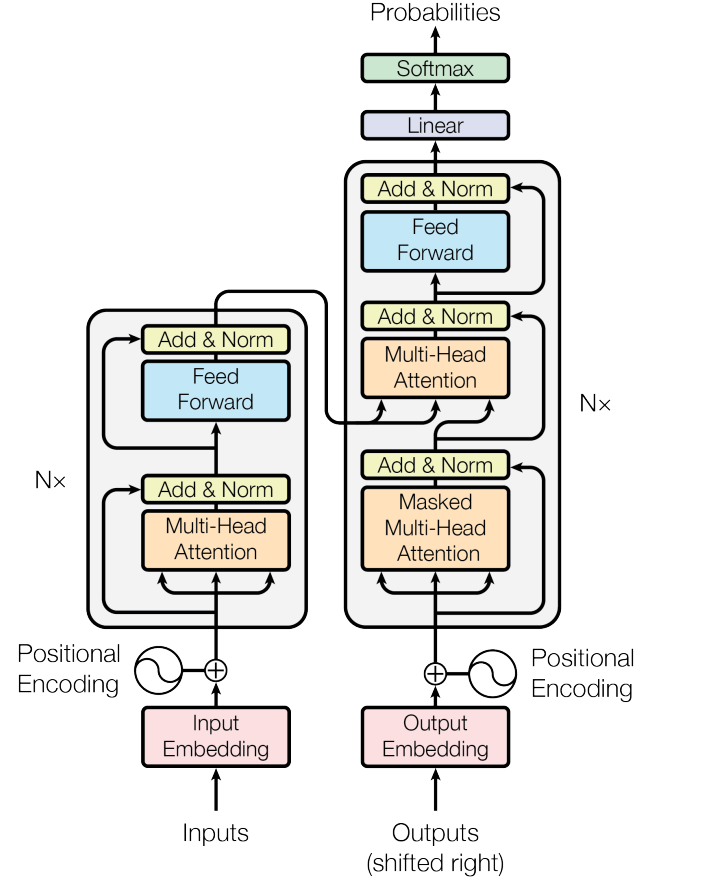
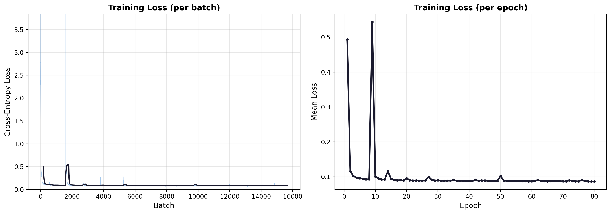

# derivax

A minimal seq2seq Transformer for symbolic math, built on raw JAX primitives.

```
f(x)  = -3x^3+4x^2-4       f(x)  = 5x+4          f(x)  = -5x^3+x^2-2x
f'(x) = -9x^2+8x            f'(x) = 5              f'(x) = -15x^2+2x-2
```

## what is this

A complete implementation of the Transformer from [Attention Is All You Need](https://arxiv.org/abs/1706.03762) (Vaswani et al., 2017), written from scratch using `jax.numpy`. No autograd, no `loss.backward()`, no framework calls. Every gradient through every layer, multi-head attention, layer normalization, feed-forward networks, embeddings, the optimizer, all of it, is derived and implemented by hand.

The model learns to differentiate polynomials by treating it as a character-level sequence-to-sequence translation problem. It picks up the power rule, sum rule, and constant rule entirely from examples.

15.8M parameters. Trained on 100k synthetic examples for 80 epochs on a Kaggle P100 in about 2 hours.

## architecture

<p align="center">
  
</p>

<p align="center"><sub>Figure 1 from Vaswani et al. (2017). derivax implements this architecture in full.</sub></p>

Config: `d_model=512`, `d_ff=1024`, `heads=8`, `d_k=64`, `layers=3`, `vocab=18`, `params=15.8M`

Post-norm residual connections, sinusoidal positional encoding, causal masking in the decoder, and cross-attention between encoder and decoder. Everything that touches a weight matrix has a hand-written backward pass: the softmax Jacobian-vector product, the scaled dot-product attention gradients through Q/K/V, the full layer norm backward with variance and mean terms, and embedding gradient accumulation at looked-up indices.

## results

Training converged within the first 10 epochs and plateaued around 0.08 cross-entropy loss.

<p align="center">
  
</p>


### accuracy by polynomial degree

| Degree | Accuracy |
|--------|----------|
| 1 (linear) | **100%** |
| 2 (quadratic) | **70.3%** |
| 3 (cubic) | **34.1%** |

### sample predictions

| Input | Expected | Predicted | |
|-------|----------|-----------|----|
| `5x+4` | `5` | `5` | correct |
| `-2x-2` | `-2` | `-2` | correct |
| `x^2-5x-1` | `2x-5` | `2x-5` | correct |
| `-5x^3+x^2-2x` | `-15x^2+2x-2` | `-15x^2+2x-2` | correct |
| `x^3+3x^2+5x+3` | `3x^2+6x+5` | `3x^2+6x+5` | correct |
| `-3x^3+4x^2-4` | `-9x^2+8x` | `-9x^2+8x` | correct |
| `3x^3+5x^2-4x+2` | `9x^2+10x-4` | `9x^2+10x-2` | wrong constant |
| `-4x^3+2x^2+3x-2` | `-12x^2+4x+3` | `-12x^2+4x-3` | sign flip |

The model gets the structural transformation right every time. It knows exponents drop by one and become multipliers, and that constants vanish. Where it slips is on the arithmetic: computing that the coefficient of `5x^3` should become `15x^2` requires multiplying 5 by 3 at the character level, with no calculator. When the numbers get large enough, it guesses. 

This is a known limitation of character-level transformers on arithmetic, compounded by greedy decoding where a single wrong digit early on has no way to be corrected.

The character-level tokenizer forces the model to learn both symbolic differentiation rules and multi-digit arithmetic simultaneously. A number-level tokenizer, where 15 is a single token instead of two, would likely improve accuracy by reducing the task to pure structural transformation. But it also removes the arithmetic reasoning component entirely, making the problem fundamentally easier rather than demonstrating a more capable model.

## what is built from scratch

The entire forward and backward pass. Token embedding, sinusoidal positional encoding, scaled dot-product attention, multi-head attention with head splitting and concatenation, layer normalization, position-wise feed-forward networks, residual connections, causal and padding masks, softmax classification, cross-entropy loss with masking, and AdamW with bias correction and decoupled weight decay.

## project structure

```
derivax/
  model/
    Transformer.py
    Encoder.py, Decoder.py
    encoderblock.py, decoderblock.py
    layers/
      MultiHeadAttention.py
      LayerNorm.py
      FeedForward.py
      dense.py
      Activation.py
      embedding.py
      PositionalEncoding.py
    optim/
      AdamW.py
      CELoss.py
  data/
    tokenizer.py
    datasets.py
    generator.py
  scripts/
    train.py
  configs/
    model_config.py, train_config.py
  utils/
    checkpoint.py
  evaluate.py
  run.py
```

## usage

```bash
python data/generator.py   # generate training data
python run.py               # train
python evaluate.py          # inference
```

## scope

Differentiates flat univariate polynomials. Positive integer exponents up to degree 5, coefficients between -5 and 5. Power rule, sum rule, constant rule. The tokenizer operates on 18 characters: `x`, `+`, `-`, `^`, digits 0 through 9, and three control tokens.

Does not support the product rule, chain rule, trigonometry, logarithms, fractions, or nested expressions.

## references

Vaswani, A., Shazeer, N., Parmar, N., Uszkoreit, J., Jones, L., Gomez, A. N., Kaiser, L., & Polosukhin, I. (2017). Attention Is All You Need. *NeurIPS*.

Kingma, D. P. & Ba, J. (2015). Adam: A Method for Stochastic Optimization. *ICLR*.

Loshchilov, I. & Hutter, F. (2019). Decoupled Weight Decay Regularization. *ICLR*.

## license

MIT
